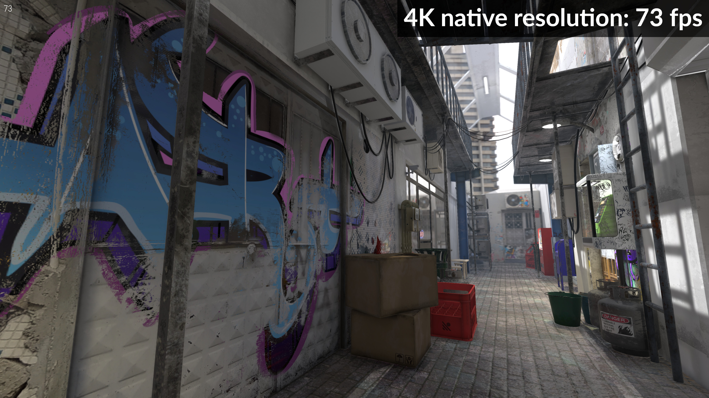
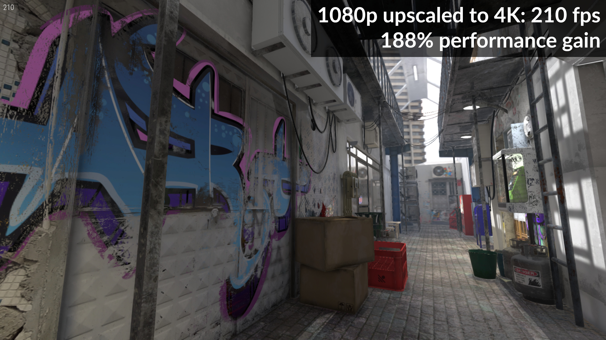

# Godot Super Scaling : Add-On For Godot Engine by Cybereality
## 2D-fixes fork by Allison Ghost

A fast viewport scaler for 3D and 2D Godot Engine games that allows you to upscale or downscale the screen for increased performance or higher quality visuals. Supports up to 200% native resolution or down to 10%. At 50% scaling on a 3D game, you could potentially get 200% to 300% of native performance, which is key to getting higher quality graphics on low-end hardware. At scales like 90%, you could gain 25% performance with very minimal picture quality loss. Going above 100% does increase quality, however the performance cost is large and might only make sense for users with very high-end graphics cards.

## INSTALLATION

For manual install, download the `SuperScaling` folder from this repository and copy it into your Godot project.

## CHANGES IN THIS FORK
* Changes from all nodes being affected, to dropping nodes into a list. (This is meant to help limit it to an active level and camera)
* Fixes offsetting of scaled viewport when including a camera
* Increases max scale_factor to 4
* Changes defaults to optimal 2D settings
* Adds category markers to the inspector (requires the [ExportHelper addon](https://github.com/Valla-Chan/Godot-Valla-ExportHelper)
* Adds static typing to variables, and re-organizes the code
* Hides most internal functions from autofill
* The SuperScaler longer removes itself, and exposed functions (`get_base_node()` and `get_node()`) have been added to get the included nodes from the SuperScaler by index or name, or to get the base node they can be attached to.

## CONFIGURATION

New:
* Add the `SuperScaling.tscn` scene to your main scene tree, it should be just below the root node.
* Add whatever nodes you want to be superscaled into the "Included Nodes" array in the SuperScaling node. Including the game world and camera is recommended.
* To have UI or HUD elements rendered at native resolution, simply do not include them in the list

* Select `Enable on Play`, this will start the scaling add-on when you play the game (cannot be viewed in editor).
* Set `Usage` to either `3D` or `2D` depending on your game type.
* `MSAA` and `FXAA` are controlled by the `SuperScaling` add-on and the project settings do not take effect.
* The `SuperScaling` add-on does add some anti-aliasing, however you may want to also enable `MSAA` or `FXAA` or both. For the best quality and performance, it is recommended to use `4x` `MSAA`. At higher render scales, using `FXAA` can help soften the image. At scales of 75% or below, it is recommended to disable `FXAA` as it can worsen picture clarity.
* `Shadow Atlas` controls the shadow map size for omni and spot lights. If you only use a directional light you can set this to `1`.
* To control the scale of the render, use the `Scale Factor` setting on the top of the inspector for `SuperScaling`.
* `1.0` for the `Scale Factor` corresponds to 100% of the native resolution. `0.5` will be 50% and `2.0` will be 200%.
* Setting the `Scale Factor` lower than `1.0` will lessen the picture quality slightly, but with much higher performance.
* Note that setting the `Scale Factor` above `1.0` results in higher definition but will have substantially lesser performance.
* Please experiment with your game and your desired minimum spec to find an appropriate setting.
* Also consider exposing the scale to users (within limits), so that they may tailor the experience to their level of hardware.
* `Smoothness` controls the mix between the two scaling algorithms. `0.0` is more sharp and `1.0` is softer.
* In general, leaving the `Smoothness` value at the default of `0.5` will have the best compatiblity at all scales.
* You should avoid setting `Smoothness` to the extremes. Values between `0.25` and `0.75` work best.
* However, this is an artistic choice and you should experiment to find the best value for your game.
* In the project settings, for 3D games, the `Stretch Mode` should be set to `disabled` and `Stretch Aspect` to `ignore`.
* For 2D games, the best project settings are `2d` for `Stretch Mode` and `keep` or `keep_height` for `Stretch Aspect`.
* Be sure that `Use VSync` is set to `On` in the project settings for the smoothest performance. Turning `Use VSync` to `Off` can result in stuttering and an overall choppy experience.
* One thing to note, `SuperScaling` will take control of your game while enabled, and you will no longer be able to edit as you play. Meaning changing variables in the inspector at run-time will not result in visible changes (though you can click the `Remote` tab on the left and edit values, if really necessary).
* So it is recommended to leave `Enable on Play` off while developing, and only enable the add-on when you need to test the graphics or performance.
* Since the add-on moves your game nodes into a dynamically generated viewport, using `get_node()` with absolute paths will no longer function. 2 functions have been added to `SuperScaler` in this fork to mitigate this: `get_base_node()` and `get_node()`. `get_base_node()` returns the Node2D that the included nodes are reparented to inside the viewport, and `get_node()` can be run with an index or name to return the included node. Both of these will work even while `Enable On Play` is turned off.

## LICENSE

MIT License

Copyright (c) 2021 Andres Hernandez
Copyright (c) 2024 Allison Ghost

Permission is hereby granted, free of charge, to any person obtaining a copy
of this software and associated documentation files (the "Software"), to deal
in the Software without restriction, including without limitation the rights
to use, copy, modify, merge, publish, distribute, sublicense, and/or sell
copies of the Software, and to permit persons to whom the Software is
furnished to do so, subject to the following conditions:

The above copyright notice and this permission notice shall be included in all
copies or substantial portions of the Software.

THE SOFTWARE IS PROVIDED "AS IS", WITHOUT WARRANTY OF ANY KIND, EXPRESS OR
IMPLIED, INCLUDING BUT NOT LIMITED TO THE WARRANTIES OF MERCHANTABILITY,
FITNESS FOR A PARTICULAR PURPOSE AND NONINFRINGEMENT. IN NO EVENT SHALL THE
AUTHORS OR COPYRIGHT HOLDERS BE LIABLE FOR ANY CLAIM, DAMAGES OR OTHER
LIABILITY, WHETHER IN AN ACTION OF CONTRACT, TORT OR OTHERWISE, ARISING FROM,
OUT OF OR IN CONNECTION WITH THE SOFTWARE OR THE USE OR OTHER DEALINGS IN THE
SOFTWARE.
